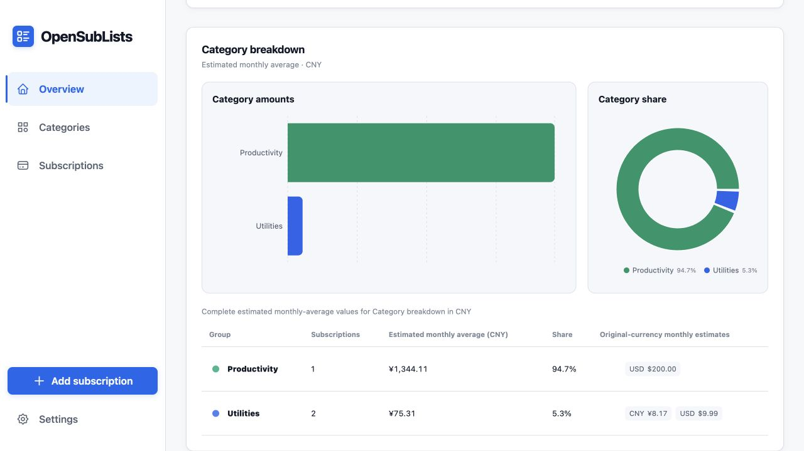
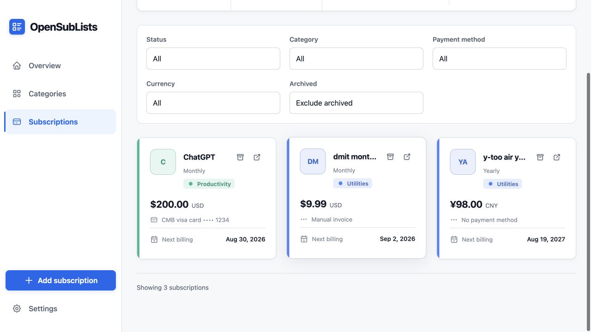

<p align="center">
  
</p>

# OpenSubLists

OpenSubLists is a small, self-hostable subscription tracker built as a responsive website on Cloudflare Workers and D1.

It provides recurring billing calculations, combined reporting-currency estimates with original-currency disclosures and separate Bar and Pie breakdowns, localized category and payment-method choices directly in the subscription editor, an information-dense category browser, common icon and emoji symbols, portable JSON import/export, independent interface and email languages, and explicit per-subscription renewal email reminders. Cloudflare Access supplies invite-only email authentication for hosted environments, while a fixed local identity keeps development fully offline from Access.

## Screenshots

### Dashboard

Compare estimated monthly costs with separate category amount and share views while
keeping every original-currency value visible.



### Subscriptions

Search, filter, categorize, and review upcoming renewals from the core subscription
ledger.



## Stack

- React, React Router, TanStack Query, and i18next in the browser.
- Hono and TypeScript in one full-stack Cloudflare Worker.
- Cloudflare D1 with explicit parameterized SQL and numbered migrations.
- Vite with the Cloudflare plugin for a production-like local runtime.
- Vitest for domain and Worker/D1 integration tests.

## Local Development

Requirements:

- Node.js 24, as pinned in `.node-version`.
- Corepack, which installs the pinned pnpm version from `package.json`.

```sh
corepack enable
pnpm install
pnpm dev
```

`pnpm dev` applies all pending migrations and then starts the website, Worker API, and local D1 binding together. Local D1 data persists in `.wrangler/state` and never touches preview or production data.

The development server listens only on `http://localhost:5173`. The production-shaped `pnpm preview` command uses the same loopback address and port.

Local requests use the fixed identity `developer@localhost.invalid`. Arbitrary user impersonation is not exposed through an HTTP header or production code path.

## Useful Commands

| Command                  | Purpose                                                     |
| ------------------------ | ----------------------------------------------------------- |
| `pnpm dev`               | Migrate local D1 and start the complete local website       |
| `pnpm db:migrate:local`  | Apply pending migrations to local D1                        |
| `pnpm typegen`           | Regenerate Worker binding and runtime types                 |
| `pnpm test`              | Run pure domain unit tests                                  |
| `pnpm test:integration`  | Run Worker and D1 integration tests                         |
| `pnpm check`             | Run formatting, lint, type checks, tests, and the build     |
| `pnpm preview`           | Build and preview the production-shaped bundle locally      |
| `pnpm docs:dev`          | Start the public documentation site on loopback             |
| `pnpm docs:build`        | Build and validate the GitHub Pages artifact                |
| `pnpm docs:preview`      | Build and preview the Pages artifact on loopback            |
| `pnpm migration:locale`  | Convert a private V3 archive to the runtime V4 format       |
| `pnpm deploy:preview`    | Build and deploy with the preview Cloudflare environment    |
| `pnpm deploy:production` | Build and deploy with the production Cloudflare environment |

## Public Documentation

The repository includes a VitePress site for the self-hosting guide. It is configured
for the default GitHub Pages project URL:

```text
https://hansarnold.github.io/SubList/
```

The documentation workflow is separate from Worker deployment and uploads only the
generated static site. The default Pages project URL is published. Run
`pnpm docs:dev` and open `http://127.0.0.1:5174/SubList/` to review changes locally.

## Self-hosting on Cloudflare

The repository tracks `wrangler.example.jsonc`, which contains only documentation
values such as `sublist.example.com` and zero UUIDs. Copy it before configuring a
hosted environment:

```sh
cp wrangler.example.jsonc wrangler.local.jsonc
```

`wrangler.local.jsonc` is ignored by Git. Replace its production hostname, Worker
name, D1 database name and ID, Access team domain, and Access application audience
with resources from your own Cloudflare account.

Cloudflare Access uses one-time email PINs, so OpenSubLists does not store passwords.
Approved emails remain in the Access policy and must not be committed. Production
also disables both `workers.dev` and version preview URLs to avoid an unprotected
alternate entry point.

To add a friend, add their exact email address to the same Access **Allow** policy.
Their isolated OpenSubLists account is created automatically on first successful
login; no application invitation, password, or manual D1 row is required. If that
friend also needs renewal email, follow the separate verified-recipient steps in the
self-hosting guide.

Renewal email is optional and provider-gated. The tracked configuration keeps it
disabled and contains no live sender binding. A self-hoster may configure a restricted
Cloudflare `send_email` binding only in the ignored private configuration; every
subscription remains independently opted out until its user explicitly enables it.

After provisioning D1 and Access, validate and release with:

```sh
pnpm deploy:dry-run:production
pnpm db:migrate:production
pnpm deploy:production
```

See [Self-hosting](./docs/self-hosting.md) for first-time setup and
[Environments and Deployment](./docs/environments-and-deployment.md) for ongoing
release and recovery procedures.

## Architecture and Product Decisions

The implementation intentionally remains one Worker plus one D1 database per environment. Business rules are runtime-independent TypeScript, and every data operation is scoped to the verified current user.

Start with the [documentation index](./docs/README.md) for the product scope, billing rules, data model, API contract, UI flow, and security decisions.

## License

OpenSubLists is available under the [MIT License](./LICENSE).
