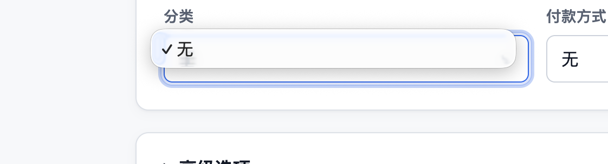

# Subscription Editor, Email Reminders, GitHub Pages, and Dashboard Charts Plan

> Status: Implemented and deployed; production sender activation remains
> operator-gated; selected interaction details are superseded by the implemented
> Phase 5 contract
>
> Last updated: 2026-08-25
>
> Scope: Direct category and payment-method creation from subscription forms,
> explicit per-subscription renewal email reminders, a public self-hosting guide on
> GitHub Pages, and useful Dashboard charts

> Phase 5 supersession: The implemented target in
> [UX Simplification, Locale Separation, Email Activation, and Dashboard Charts Plan](./ux-simplification-locale-email-and-charts-plan.md)
> replaces this document's preset-facing labels and Settings presentation, shared
> interface/email locale, language/provider warning treatment, Bar/Donut mode switch,
> and single-group chart suppression. This document remains authoritative history for
> the ordinary tenant-row preset model, resource editor reuse, recurrence planning,
> D1 outbox and idempotency rules, privacy boundary, and provider adapter.

## 1. Outcome

This follow-up removes the remaining gap between the preset catalogs and the primary
subscription workflow. A person creating or editing a subscription must be able to
choose an existing category or payment method, create one from a preset, or create a
custom one without leaving the form.

The same delivery phase also delivers an optional renewal-email capability, adds a
public documentation site beside the GitHub repository, and introduces purposeful
Dashboard charts. Emails and charts remain estimates derived from the current
subscription definitions; they do not imply observed payments or historical
spending.

The intended result is:

- Category and payment-method presets are available from both Create Subscription
  and Edit Subscription.
- Presets still create ordinary tenant-owned rows that can be edited or deleted.
- Empty accounts never present a misleading selector containing only `None`.
- Each subscription can explicitly enable or disable one renewal email and either
  inherit the account lead time or choose its own `n` days.
- Existing subscriptions and imports remain opted out until the user enables them.
- The public self-hosting guide is buildable for the repository's default GitHub
  Pages project URL without a custom domain; publication is an operator action.
- Category and payment-method breakdowns support accurate bar and donut views with
  complete text equivalents.
- A later chart increment can show a 12-month projected-charge series without
  pretending that OpenSubLists stores transaction history.

## 2. Approval-time Evidence



The screenshot captured the valid empty-data state before implementation, not a
loading placeholder. At approval time the form successfully loaded
`GET /api/v1/categories` and `GET /api/v1/payment-methods`, then rendered `None`
followed only by returned tenant rows. The implemented association fields now expose
existing rows, preset creation, and custom creation in that same state.

At approval time the preset catalogs already lived in `src/shared/presets.ts`, but
were connected only to onboarding and Settings:

- Category onboarding and Category Settings can materialize category templates.
- Payment Method Settings can prefill a template that the user then saves.
- Subscription Create and Edit did not read the preset catalogs.
- The server deliberately does not seed payment methods or persist global preset
  records.

The approval-time Dashboard also had a correctness gap: category progress-bar geometry
used subscription count while the adjacent value showed a reporting-currency monthly
estimate, and payment methods appeared only as a list. The implemented Dashboard uses
the displayed converted metric for both category and payment-method Bar and Donut
views. Time-series and projected-month charts remain the explicit follow-up.

At approval time only the reminder foundation existed: verified primary email, an IANA
time zone, recurrence projection, and the daily FX handler. The implementation now
adds explicit preferences, a D1 delivery ledger, persisted email locale, retry policy,
provider adapters, and an independent hourly handler. The tracked deployment example
still omits the native binding and keeps the capability disabled.

## 3. Approved Product Decisions

### 3.1 Presets Remain Creation Templates

Do not add global preset tables, protected system rows, `is_preset` flags, or preset
foreign keys on subscriptions. A preset is an application-owned draft. Once saved,
it is an ordinary category or payment method owned by the current user.

This preserves the current model:

- Existing resources continue to use their UUIDs.
- A saved preset can be renamed, recolored, reordered, or deleted.
- Changing application language never renames persisted user content.
- Custom and preset-created resources follow the same validation and tenant limits.
- Import and export formats remain unchanged.

No D1 migration or automatic data backfill is required. Existing empty accounts see
the catalog immediately after the UI ships and create only the resources they
actually choose.

### 3.2 Resource Creation Is Explicit

Selecting an unmaterialized preset opens a small editable draft before it creates a
row. The user reviews the localized name and the safe metadata, then selects
`Create and use`.

The new resource is reusable account data. If the person later cancels the
subscription form, the category or payment method intentionally remains in Settings.
This makes the side effect clear and lets the existing resource APIs remain the
authoritative write path.

### 3.3 Category and Payment-method Behavior Is Symmetric

Both association fields expose the same top-level choices:

1. `None`.
2. Existing resources owned by the current account.
3. Create from a preset.
4. Create custom.
5. Manage all resources in Settings.

Their editable drafts differ only where the underlying resources differ:

- Category: name, color, and symbol.
- Payment method: name, kind, symbol, and an optional safe display label.

The payment label must never request or store a full card number, account number,
security code, password, or payment token.

### 3.4 Charts Visualize Estimates, Not Activity

Monetary charts use the reporting-currency monthly average unless their title says
otherwise. Chart geometry, visible values, tooltips, and accessible labels must use
the same metric.

The UI must never:

- Add raw values from different currencies.
- Turn unavailable FX values into zero.
- Fall back from money to subscription count under an unchanged chart title.
- Label a projection as actual spend, payment history, or a historical trend.

### 3.5 GitHub Pages Hosts Documentation Only

The documentation site uses the same GitHub repository and the default project URL:

```text
https://hansarnold.github.io/SubList/
```

Do not add a `CNAME`, change DNS, or configure a Pages custom domain. GitHub Pages
hosts only the public static guide. It cannot host the authenticated Worker API or D1
application. The supported OpenSubLists application deployment still requires an
operator-controlled hostname managed by Cloudflare.

### 3.6 Renewal Emails Are Explicit Per-subscription Choices

An amount, currency, payment method, or informal description such as "manual
renewal" must never enable a reminder automatically. The current domain does not
model manual versus automatic renewal, and reporting-currency conversion must not
gate delivery.

The account supplies a default lead time for convenience, but that default never
enables email by itself. Each subscription stores an explicit enabled state and may
inherit or override the account default. Existing subscriptions, imported records,
and new subscriptions default to disabled until the user opts in.

The first release supports one logical reminder and one D1 delivery row per
subscription billing occurrence. It keeps browser push, multiple configured reminders
for one occurrence, amount thresholds, and automatic recommendation rules outside this
phase. The native adapter does not automatically retry an ambiguous provider result;
that outcome is visible as `unknown` instead.

## 4. Subscription Resource Picker

### 4.1 Shared Component Boundary

Extract a shared association field and the existing resource editors rather than
building another preset implementation inside the subscription feature.

The target frontend responsibilities are:

- `ResourceAssociationField`: selected value, existing-resource list, preset and
  custom actions, keyboard behavior, and field-level states.
- `CategoryEditor`: create or edit name, color, and symbol.
- `PaymentMethodEditor`: create or edit name, kind, safe label, and symbol.
- Preset-to-draft functions: turn an application preset into localized editable
  create input.

Only persisted UUIDs belong in subscription form state. Preset keys and unsaved
drafts belong to the association-field UI state and never enter a subscription
payload.

An appropriate draft state is:

```ts
type AssociationDraft<TPresetKey, TCreateInput> =
  | { mode: "closed" }
  | { mode: "preset"; key: TPresetKey; input: TCreateInput }
  | { mode: "custom"; input: TCreateInput };
```

### 4.2 Picker Interaction

The closed field shows the selected resource's symbol and name, or `None`. Opening it
shows these sections in order:

1. Search, when the combined list is long enough to need it.
2. Existing account resources.
3. Preset templates that can be reviewed and created.
4. `Create custom`.
5. `Manage in Settings`.

Selecting an existing row immediately updates the subscription draft. Selecting a
preset or `Create custom` opens the compact editor in a popover or dialog on wide
screens and a sheet on narrow screens. A successful resource create inserts the
returned row into the query cache and selects its UUID.

If a category preset's localized normalized name already exists, the picker should
select or point to that row instead of encouraging a duplicate. Payment-method
templates may create multiple rows because a person can have more than one card or
account of the same kind.

### 4.3 Create and Edit Parity

The exact association fields appear in both Create Subscription and Edit
Subscription:

- Edit initializes from the currently persisted UUID.
- `None` clears the association only when the main subscription form is saved.
- Creating a new resource selects it without discarding other unsaved subscription
  changes.
- A resource created from Edit becomes immediately reusable in all other forms.
- Navigating to Settings includes a safe return destination. Unsaved form values are
  not silently discarded; use an explicit warning until draft preservation exists.

### 4.4 Loading, Empty, and Error States

- Loading: disable the field and show localized loading copy or a stable skeleton.
- Successful empty list: keep `None`, presets, and custom creation visible.
- Query error: show an inline error and Retry; do not render a misleading
  `None`-only field.
- Edit plus resource-query failure: preserve the current UUID and disable association
  changes until Retry succeeds.
- Resource-create validation failure: keep the editor and its values open.
- Resource-create network failure: preserve the draft and expose Retry.
- While an inline resource create is pending, prevent duplicate creation and disable
  the main subscription submit action.
- If the session identity changes, clear tenant resource queries or include the
  stable application user ID in their cache keys.

### 4.5 API and Tenant Isolation

The existing API remains sufficient:

- `GET` and `POST /api/v1/categories`.
- `GET` and `POST /api/v1/payment-methods`.
- Existing subscription create and update endpoints with `categoryId` and
  `paymentMethodId`.

Preset localization stays client-side. The browser must never send a `userId`, and
the Worker must continue deriving the tenant from the verified identity. The newly
created resource UUID is not associated with the subscription until the normal
subscription write passes the existing tenant-scoped relationship validation.

## 5. Dashboard Chart Plan

### 5.1 First Correctness Fix

Replace the current mixed metric before adding new chart shapes. A category bar that
shows a monetary value must use `reportingMonthlyAverage` for its length, visible
label, sort order, and accessible name. If the product keeps a count view, it must be
separately titled `Subscriptions by category` and use counts everywhere.

The first release uses estimated monthly average as the primary breakdown metric.

### 5.2 Required Breakdown Views

Provide two breakdown cards that match the selected SubList-inspired direction:

1. Estimated monthly average by category.
2. Estimated monthly average by payment method.

Each card provides `Bars` and `Donut` controls. Bars remain the default because they
make close values easy to compare; Donut supplies the requested composition view.
The selected state must be programmatically exposed and may be retained as a local
display preference.

For each view:

- Use converted `reportingMonthlyAverage` values from one Dashboard response and one
  FX snapshot.
- Sort by amount, not subscription count.
- Keep `Uncategorized` and `No payment method` as explicit groups.
- Show the reporting currency, estimate label, FX provider state, and rate date next
  to the visualization.
- Put a ranked HTML list or table beside or below the chart. It is the authoritative
  text equivalent and includes amount, approximate share, and subscription count.
- Show original-currency monthly amounts in the list or disclosure panel.
- With more than six positive groups, draw the top five plus `Other` while retaining
  every row in the complete text list.

Category data already contains original-currency details. Payment-method breakdowns
must gain the same `totalsByCurrency` shape before their monetary chart is considered
complete.

### 5.3 Sparse and Failure States

- No active, unarchived subscriptions: show a direct empty explanation, not an empty
  ring.
- One positive group: show a 100% value card and list instead of a decorative full
  donut.
- Two to six groups: show every positive slice.
- All values zero: show the zero-valued rows and no chart.
- FX unavailable: hide the amount chart, name the missing currencies, and preserve
  original-currency values. Do not substitute a count chart under the same title.
- FX stale: the chart may render with the stale warning and rate date.
- No charges in the selected 7- or 30-day agenda is independent from recurring
  monthly estimates; breakdown charts may still render.

### 5.4 Accessibility and Rendering

- Use a maintained React chart library that renders SVG; do not hand-build chart
  geometry or use canvas as the only representation.
- Treat the SVG as supplementary when the adjacent HTML list contains all values.
- Do not rely on color alone. Use labels, ordered legends, separators, symbols, and
  an accessible fallback palette when user category colors collide or lack contrast.
- Tooltips must work with focus and touch, not hover alone.
- Use practical 44 by 44 pixel touch targets for view controls.
- Respect reduced motion and forced-color modes; chart animation is unnecessary.
- Use localized money and date formatting with tabular numerals.

A small compatibility and bundle-size spike should select the chart dependency
before implementation. Recharts is the initial candidate; the decision must be
recorded before it enters the lockfile.

### 5.5 Projected Charges Follow-up

After the two breakdown cards are accepted, add a 12-month column chart titled
`Projected charges by month`. It requires a server-aggregated series such as:

```ts
type MonthlyProjection = {
  month: string;
  occurrenceCount: number;
  reportingAmount: ReportingEstimate | null;
  totalsByCurrency: Array<{ currency: string; amount: string }>;
};
```

The series begins with the user's current local month, covers twelve complete local
calendar months, uses current active and unarchived subscription definitions, and
shares the Dashboard's FX snapshot. It is a projection, not a historical line chart.

Do not add a raw-currency pie. A future currency-mix donut is valid only after the API
returns converted per-source-currency contributions while retaining each original
amount.

## 6. Public Self-hosting Site on GitHub Pages

### 6.1 Technology and Repository Layout

Use VitePress as an exactly pinned development dependency and keep the public site
under `site/`. The implemented pin is recorded in `package.json`; re-check the current
official release only if implementation happens in a later maintenance cycle.

```text
site/
├── .vitepress/
│   └── config.mts
├── index.md
└── guide/
    └── self-hosting.md
```

The Cloudflare application build and the documentation build remain separate.
VitePress outputs only `site/.vitepress/dist`, and the Pages workflow uploads only
that directory.

`docs/self-hosting.md` remains the canonical source. The public guide includes that
Markdown from `site/guide/self-hosting.md` rather than maintaining a second copy of
the deployment instructions.

### 6.2 Site Configuration

- Configure `base: "/SubList/"` because this is a project Pages site.
- Use `lang: "en-US"`, a clear title and description, local search, repository/edit
  links, last-updated timestamps, and a sitemap for the default Pages URL.
- Do not add a custom domain or `CNAME`.
- Do not mix Cloudflare deployment output into the static site.
- Add `docs:dev`, `docs:build`, and `docs:preview` package scripts without changing
  the existing application `dev`, `build`, or deployment scripts.
- Ignore VitePress cache and output directories.

### 6.3 Public Information Architecture

The landing page explains what OpenSubLists is, shows the selected Dashboard image,
links to the repository, and starts with two choices: run locally or self-host on
Cloudflare.

The self-hosting guide covers:

1. What gets deployed and which parts remain free-tier eligible.
2. Prerequisites: GitHub, Cloudflare, Node, pnpm, and an operator-owned Cloudflare
   hostname for the application.
3. Fork and clone.
4. Local development with local D1.
5. Create D1 and apply migrations.
6. Configure Cloudflare Access OTP and the email allowlist.
7. Copy the example configuration and keep real values ignored by Git.
8. Dry-run, deploy, and manually trigger the initial FX refresh.
9. Optionally configure the provider-gated reminder sender, verified destinations,
   hourly Cron, no-send scan, and operator-only first delivery with the free-versus-paid
   recipient boundary stated explicitly.
10. Verify Access, tenant identity, CRUD, Dashboard estimates, and export.
11. Invite or remove a friend through Access policy and, when reminders are enabled,
    update both Access and email delivery state.
12. Update, back up, restore, and roll back.
13. Troubleshoot common Pages, Wrangler, Access, D1, Cron, and email-provider failures.

The guide must clearly distinguish the public GitHub Pages documentation URL from
the private Cloudflare-hosted application URL.

### 6.4 GitHub Actions

Add a dedicated `.github/workflows/pages.yml` rather than coupling documentation
publishing to Worker deployment.

- Trigger on pushes to `main` and `workflow_dispatch`.
- Validate `pnpm docs:build` in normal CI and pull requests without deploying.
- Build with the repository's pinned Node and pnpm versions.
- Configure Pages, upload only `site/.vitepress/dist`, and deploy through the
  `github-pages` environment.
- Grant only `contents: read`, `pages: write`, and `id-token: write`.
- Use one `pages` concurrency group and do not cancel an in-progress deployment.
- In repository Settings, select `GitHub Actions` as the Pages publishing source
  before the first release.

### 6.5 Public-artifact Security

The published artifact must never contain:

- `wrangler.local.jsonc`.
- Access audiences, allowed email addresses, private hostnames, or tokens.
- D1 identifiers or backups.
- Operator migration artifacts or private verification records.
- Repository source files that are not part of the generated documentation site.

Examples use `wrangler.example.jsonc` and obvious placeholders only. The Pages build
must fail if required links or included source files are missing.

## 7. Per-subscription Renewal Email Reminders — Implemented and Provider-gated

### 7.1 Product Value and Release Boundary

Renewal email is not required for the application to function as a subscription
ledger. It is especially useful when a person must take action before renewal or wants
to reconsider an infrequent subscription. The implementation remains independently
provider-gated, so it does not block the resource picker, charts, or public
documentation phases.

The first release is intentionally bounded:

- One email channel only.
- One logical reminder and D1 delivery row for each subscription billing occurrence.
- Explicit opt-in on every subscription; no amount or renewal-type heuristic.
- Recipient is the account's current `primary_email`, last verified through the
  authentication flow.
- Original subscription amount and currency are shown; FX availability is irrelevant.
- Only active, unarchived subscriptions are eligible.
- A deployment without a configured sender remains fully usable and advertises the
  reminder capability as unavailable.

Removing an address from the Cloudflare Access allowlist does not update D1 by itself.
The user therefore receives a `Pause all email reminders` control, and the operator
must disable the recipient at the email provider when removing access for someone who
cannot sign in again.

On a successful later login, the identity resolver refreshes `primary_email` from the
verified Access assertion in the same transaction as the identity record. If that
normalized address already belongs to another application user, account resolution
fails closed and sets a system-owned reminder suspension for the existing user until
an operator resolves the collision; the scheduler never guesses which mailbox to use.
Clearing that suspension also forces the account pause and advances its reminder
revision. The user must sign in again to refresh the verified address and explicitly
unpause before delivery can resume.

### 7.2 Account Defaults and Subscription Preference

The implemented account fields are:

- `defaultEmailReminderDaysBefore`, default `7`, integer range `0..365`.
- `emailReminderLocalTime`, default `09:00`, restricted initially to whole-hour
  `HH:00` choices and interpreted in the user's IANA time zone.
- `emailLocale`, one of `en` or `zh-Hans`, persisted because a background Worker
  cannot read the independently saved browser-interface locale. `interfaceLocale` is
  a separate profile preference and never renders reminder content.
- `emailRemindersPaused`, default `false`, a global suppression control that never
  enables a subscription.

Persistence also carries a system-owned suspension reason. It is independent of the
user pause, is not editable through `/me`, and initially covers identity-email
collisions. Effective account suppression is user pause, system suspension, or an
unavailable deployment sender. Only the user pause is a portable account preference.

The implemented subscription fields are:

- `emailReminderEnabled`, default `false`.
- `emailReminderDaysBefore`, nullable integer range `0..365`; `null` means use the
  account default and never means disabled.

`0` means the renewal date. The subscription editor shows the read-only destination
address, an explicit email toggle, `Use account default — N days before` using the live
account value, and a custom
lead-time choice. When enabled, it previews the calculated reminder date and labels
the renewal as an estimate. Subscription Detail shows the effective lead time and
next planned reminder date.

The per-subscription toggle is the only feature-level opt-in. Amount, currency,
payment method, recurrence type, and whether renewal needs manual action may explain
why a person enables the toggle, but none of them enables or disables email
automatically.

Changing the account default affects only subscriptions that still inherit it.
Changing a lead time after an email was sent must not send another email for the same
billing occurrence. Disabling, cancelling, or archiving a subscription suppresses
future sends without deleting the preference or delivery audit.

### 7.3 Recurrence and Local-time Semantics

Reminder selection must use the authoritative recurrence rule, not only the
materialized `nextBillingOn` value. For a planning local date `D`:

1. Resolve the account time zone and effective lead days.
2. Compute `targetBillingOn = D + effectiveDaysBefore` with calendar-day arithmetic.
3. Ask the recurrence domain whether `targetBillingOn` is an occurrence.
4. If it is, derive the intended UTC delivery instant from the configured local time.
5. Create or claim the delivery keyed to that target billing occurrence.

This is required for short intervals. A weekly subscription with a seven-day lead may
have `nextBillingOn` equal to today while the reminder due today belongs to next
week's occurrence. `nextBillingOn - leadDays` would miss it.

The existing materialized date is reconciled before the scheduled scan for overall
consistency, but it is not the only candidate. The hourly job uses
`controller.scheduledTime` or an injected clock and sends on the first run at or after
the user's local delivery time. A same-local-day grace window handles a late Cron run
without replaying several days of reminders after an extended outage.

The first release limits the setting to whole-hour values because the Worker runs once
per hour. This guarantees at least one eligible hourly run remains on the same local
date, including for `23:00`. Supporting arbitrary minutes later requires scanning an
explicit `(lastScanAt, now]` UTC interval while preserving each intent's original local
planning date; merely comparing the current local date would miss late-night values.

If the chosen local hour does not exist during a DST spring-forward gap, use the first
valid instant after the gap on the same local date. If it occurs twice during a
fall-back overlap, use the earlier offset and first occurrence only. The delivery-row
uniqueness key remains the final duplicate guard. A time-zone change recalculates
future intent and may reschedule or reopen an unattempted row, but cannot reopen an
attempted or terminal delivery for that subscription occurrence.

### 7.4 Persistence and API Contract

Use additive migrations rather than a generic JSON settings column. Migration 0005
adds the account and subscription fields above, bounded database checks, and a partial
scan index for active, unarchived, reminder-enabled subscriptions. Existing users
backfill to `en`, seven days, `09:00`, and not globally paused; existing subscriptions
backfill to disabled with an inherited lead time. It also adds system-owned,
non-negative reminder revision counters to users and subscriptions, both backfilled to
zero, plus a nullable account suspension reason. Migration 0007 then keeps
`preferred_locale` as API `interfaceLocale` storage, adds `email_locale`, and copies
the previous shared locale into it. Reminder rendering reads only API `emailLocale`.

Add a `renewal_email_deliveries` D1 table containing:

- User and subscription ownership.
- `billing_on` and the effective lead days used.
- Intended delivery time, exact state, attempt count, claim time, lease expiry,
  `expires_at`, and next-attempt time.
- Sent time, nullable opaque provider message ID, and a stable redacted error code.
- Frozen provider key and configuration revision, stable application idempotency key,
  template version, and the planned user and subscription reminder revisions.
- A composite foreign key to the owning subscription with `ON DELETE CASCADE`.
- A uniqueness constraint on `(user_id, subscription_id, billing_on)`.

Lead days are deliberately absent from the uniqueness key. The product creates one
logical delivery row per occurrence, even when the preference changes later. The table
must not store a second copy of the recipient address, rendered subject, or message
body.

The API changes are:

- Extend `/api/v1/session` with `capabilities.emailReminders` so optional provider
  configuration is visible without exposing provider secrets.
- Extend `GET` and `PATCH /api/v1/me` with the account fields.
- Extend subscription create, read, and patch contracts with the two subscription
  fields. Partial update semantics must preserve `null = inherit` distinctly from
  `false = disabled`.
- Extend Subscription Detail with one coarse provider-neutral delivery summary:
  `none`, `scheduled`, `paused`, `retrying`, `sent`, `failed`, `unknown`, or `expired`,
  plus the billing occurrence and last-attempt time when present.
- Keep the full delivery ledger and provider details internal; they are operational
  state rather than user-facing payment history.

Current archive schema V4 includes account defaults, independent interface and email
locales, pause state, and subscription preferences. Delivery rows are never exported.
Legacy transformations default reminders to disabled unless a reviewed archive
explicitly contains the preference. If the deployment lacks a sender, a reviewed V4
archive preserves enabled per-subscription choices but forces the account pause on;
the user must explicitly unpause after provider setup.

### 7.5 Scheduled Delivery and Reliability

Keep reminders in the existing full-stack Worker and add a separate hourly Cron
expression beside the daily FX refresh. The scheduled entrypoint dispatches jobs by
the matched Cron expression so an FX failure cannot suppress reminders and an email
failure cannot suppress FX refresh.

Implement these boundaries:

- `RenewalReminderService` for selection and orchestration.
- `ReminderStore` for cross-tenant scheduled scans, claims, retries, and delivery
  state.
- `EmailSender` for provider-independent text and HTML delivery.
- `resolveReminderWindow` as the tested domain boundary for local wall time, DST
  disambiguation, UTC intent, and next-local-midnight expiry.

The job inserts or atomically claims a delivery before calling the provider, processes
a bounded batch, and revalidates the current user, subscription lifecycle, occurrence,
preference, and destination immediately before send. A claim lease expires after 15
minutes. `expires_at` is the exclusive start of the next local calendar date after the
intended reminder date, converted to UTC. No attempt starts at or after that instant;
an unclaimed `pending` or `retry_wait` row becomes terminal `expired` instead of
creating a multi-day catch-up email. A stale `sending` lease always follows the
ambiguous-result rule below, even when discovered after `expires_at`.

The delivery state machine atomically claims either `pending` or due `retry_wait` as
`sending`, increments `attempt_count`, sets a fresh claim and 15-minute lease, and
clears `next_attempt_at`. `sending` then moves to `sent`, `retry_wait`, `failed`, or
`unknown`; `cancelled` and `expired` are terminal. The provider adapter returns exactly
one of four outcomes:

- `accepted`: mark `sent`.
- `definitely_not_accepted_retryable`: move to `retry_wait`, with at most three total
  attempts and bounded backoff before `expires_at`; if the third attempt returns this
  outcome, mark terminal `failed` with `retry_exhausted` instead of leaving an
  unclaimable retry row.
- `permanent`: mark `failed` with a stable redacted error code.
- `ambiguous`: mark `unknown`; the native adapter never retries an outcome that may
  already have been accepted.

A stale `sending` lease is `ambiguous` unless the adapter itself resolves the outcome
through provider idempotency before returning. This deliberately prefers an occasional
missed reminder over an application-generated duplicate when the native binding cannot
prove the result. A native-binding exception or timeout is also `ambiguous` unless
current Cloudflare documentation provides an explicit non-acceptance guarantee for
that exact error. The initial native adapter may therefore never emit
`definitely_not_accepted_retryable`; it must not translate a generic thrown `Error`
into that outcome.

Before the first provider attempt, a lead-time, local-time, time-zone, email-locale,
recipient, subscription-content, or recurrence change may update or cancel the pending
row. Global pause gates both `pending` and `retry_wait`: they remain dormant until
unpaused, then resume only when their versions still match and `expires_at` has not
passed. Per-subscription opt-out, cancellation, or archive cancels unattempted and
safe-to-retry rows immediately. Re-enabling may reopen the same row only when no
provider attempt ever started and the newly calculated reminder window is still open;
after any attempt, re-enabling applies to the next billing occurrence.

On the first provider attempt, freeze the provider key and configuration revision,
template version, application idempotency key, and planned user/subscription versions.
Every write that can change reminder eligibility, scheduling, destination, or rendered
content must advance the corresponding reminder-specific revision. Reads, no-op
identity refreshes, display-name edits, and pause/unpause do not. A safe retry
reconstructs the envelope only when the provider key/configuration revision, template
version, and both reminder revisions still match; otherwise it becomes terminal
`cancelled`. `sent`, `failed`, `unknown`, and `expired` occurrences never reopen after
a preference edit. An in-flight send cannot be recalled, so opt-out suppresses only
attempts that have not started.

D1 is the durable outbox and delivery ledger for this scale. Do not add Cloudflare
Queues initially: the personal limit is 50 subscriptions per account, and a Queue
would still require the same idempotency ledger while adding a D1-to-Queue dual-write
boundary. Introduce a Queue consumer only when measured volume, retry latency, or
execution limits justify it.

External exactly-once delivery cannot be guaranteed unless the selected provider
accepts an idempotency key. `EmailSender` always receives the stable application key,
but the native Cloudflare binding does not currently document an input that uses it. A
crash after provider acceptance but before the D1 success write is therefore
inherently ambiguous and becomes terminal `unknown`; it is not automatically retried
by the native adapter. D1 guarantees one logical delivery row and prevents ordinary
duplicate planning, while the UI and documentation avoid claiming exactly-once
physical email.

### 7.6 Cloudflare Email Provider and Free-plan Boundary

Use an `EmailSender` port. The initial production adapter uses the native Cloudflare
Workers `send_email` binding; local and CI use a deterministic fake that records only
non-sensitive delivery metadata and never contacts a mailbox.

For the current Workers Free plan, Cloudflare can send free of charge to destination
addresses that the operator has added and the recipient has verified. Sending to
arbitrary recipients through Cloudflare Email Sending requires Workers Paid. This
makes the verified-destination path suitable for the initial owner and a few friends,
but it must remain an explicit self-hosting step rather than an assumption based on
the Access allowlist.

At this plan's update date, Workers Free allows five Cron Triggers per account. The
existing daily FX trigger plus one hourly reminder trigger fits that allowance; the
configuration does not by itself opt the operator into a paid Workers plan. Operators
must still review current platform limits before enabling the optional feature.

An operator may onboard a dedicated Email Routing subdomain such as
`notify.example.com` so reminder mail configuration does not reuse the application
hostname. Real sender addresses, recipient restrictions, provider tokens, and domain
metadata belong only in ignored deployment configuration or encrypted secrets. The
repository contains placeholders.

If the operator later needs arbitrary recipients on a free Workers deployment, add a
reviewed HTTP email-provider adapter rather than coupling reminder logic to another
vendor. Provider selection does not change the reminder model or delivery ledger.

Local and preview verification includes the Cloudflare Vite scheduled route with
explicit Cron and scheduled-time parameters. Preview may use the fake sender or a
strict operator-only destination. Local or preview rollout manually invokes the
scheduled route with no enabled subscriptions. Production then observes one normal
hourly no-send run, enables one operator reminder, verifies one delivery, and only then
enables friend reminders.

### 7.7 Message, Privacy, and Failure UX

Each email contains both text and HTML forms with:

- Subscription name.
- Original amount and currency.
- Projected billing date and relative lead time.
- Recurrence summary.
- A link to the authenticated Subscription Detail or `/settings/profile`.
- Clear wording that this is a ledger estimate, not proof of a charge or payment.

Do not include notes, payment labels, Access details, or sensitive deployment metadata.
Logs and traces must not contain recipient addresses, subscription names, subjects,
bodies, provider response bodies, or raw exceptions. Use internal IDs, counts, attempt
numbers, duration, and stable error codes.

When the provider is absent, the editor explains that the operator has not configured
email and does not pretend the reminder is active. When a provider becomes unavailable
after preferences exist, the preferences remain saved, delivery is paused, and
Settings shows a deployment-level warning without exposing provider internals.

Subscription Detail always shows the coarse state for the relevant occurrence. It
distinguishes a planned or paused reminder from retrying, sent, permanently failed,
expired, and `unknown` delivery. The UI never exposes provider names, message IDs, raw
errors, or a recipient-verification allowlist, but it must not silently present a
terminal failure as an active reminder.

## 8. Testing Strategy

### 8.1 Subscription Editor

- Empty successful responses expose presets and custom creation, not a bare selector.
- Loading, query error, Retry, create error, and create-pending states.
- Existing category and payment-method selection in both Create and Edit.
- Category preset to editable draft to persisted UUID to subscription payload.
- Payment preset review, safe label, and multiple same-kind instances.
- Custom resource creation and immediate selection.
- Edit preserves, replaces, and clears associations correctly.
- Canceling an unsaved resource draft performs no write.
- Canceling the main subscription form after resource creation keeps that resource.
- Locale changes affect only new preset drafts.
- Query-cache insertion, invalidation, and identity-change isolation.

Existing integration tests continue to cover tenant-scoped resource CRUD,
cross-tenant reference rejection, per-user limits, normalized-name conflicts,
payment-label validation, and detachment on delete.

### 8.2 Dashboard

- Bar and donut geometry uses the same converted amount shown in text.
- Sorting, percentage calculation, top-five-plus-Other aggregation, and complete list
  preservation.
- Category and payment-method original-currency disclosure.
- One group, all-zero, no-active-subscription, stale-FX, and unavailable-FX states.
- Accessible names, text equivalence, keyboard controls, and touch behavior.
- Narrow and wide layouts, dark mode, forced colors, and reduced motion.
- Twelve-month projection boundaries, annual renewals, short recurrence intervals,
  mixed currencies, and all-or-nothing conversion in the follow-up phase.

### 8.3 GitHub Pages

- A clean Node 24 checkout passes frozen install, `pnpm check`, and
  `pnpm docs:build`.
- Local preview works under `/SubList/`, including direct page reloads, anchors,
  search, edit links, and assets.
- Desktop and mobile navigation, keyboard focus, heading order, and contrast pass a
  manual smoke test.
- Pull requests build but do not deploy; `main` and manual runs may deploy.
- The artifact contains only generated public files and no operator configuration.
- The repository contains no `CNAME`, and Pages Settings has no custom domain.

### 8.4 Renewal Email Reminders

- Explicit opt-in, opt-out, account default, subscription override, and global pause.
- Sender-capability checks on create and the stored `false -> true` transition, while a
  complete unrelated edit of an already-enabled imported record remains allowed.
- `null = inherit`, `0 = renewal day`, and `0..365` validation in the API and D1.
- Daily and weekly recurrence where the lead time equals or exceeds the interval.
- Month-end, leap-day, future-anchor, UTC-12, UTC+14, DST gap, and DST overlap cases.
- Active versus cancelled and archived eligibility.
- Email-locale and original-currency rendering with no FX dependency; interface-locale
  changes do not alter an envelope revision.
- Primary-email refresh, provider unavailable, permanent rejection, temporary failure,
  identity-email collision pause, retry exhaustion, and stale claim recovery.
- Reminder-specific revision changes versus ordinary reads/no-op identity refreshes;
  user pause cannot clear system suspension, and unavailable capability rejects
  unpause.
- Duplicate and overlapping scheduled invocations, preference changes after send, the
  one-logical-delivery-row-per-occurrence constraint, accepted, definitely-not-accepted,
  permanent, and ambiguous provider outcomes.
- Whole-hour delivery intent, exact DST gap/overlap policy, same-local-day retry
  expiry, 15-minute claim expiry, mutation/provider locking after the first attempt,
  and no automatic retry after an ambiguous native-provider result.
- Opt-out, global pause, re-enable before and after an attempt, and coarse delivery
  summary states.
- Due `retry_wait` re-claim, attempt/lease reset, derived pre-due `scheduled` state,
  expired-send-to-`unknown`, and current-day terminal-state precedence.
- FX and reminders fail independently.
- Local fake sender, preview restrictions, manual scheduled invocation, and production
  operator-only smoke delivery.
- Existing-user defaults and split-locale backfill, V4 archive round-trip, legacy import
  default-off behavior, unavailable-provider forced pause, and delivery-history
  omission.
- Logs contain no email address, subscription name, message content, or raw provider
  error.

## 9. Implementation Sequence

### Phase A: Shared Resource Creation — Implemented

1. Add focused subscription-form component tests for the current empty state.
2. Extract reusable category and payment-method editors and preset draft builders.
3. Implement the accessible association field and explicit create-and-use flow.
4. Wire Create and Edit Subscription to the shared fields and existing APIs.
5. Verify query-cache and tenant-identity behavior.

### Phase B: Breakdown Charts — Implemented

1. Correct the current category bar metric.
2. Add payment-method original-currency breakdown parity to the Dashboard contract.
3. Complete the chart-library compatibility and bundle-size spike.
4. Add Bar and Donut views plus authoritative HTML lists.
5. Verify sparse, FX, accessibility, and responsive states.

### Phase C: GitHub Pages — Published

1. Add the pinned VitePress dependency, `site/` source, and package scripts.
2. Expand the canonical self-hosting guide and include it in the public site.
3. Add CI build validation and the dedicated Pages deployment workflow.
4. Operator gate: enable GitHub Actions as the Pages source and perform the first
   manual publish.
5. Operator gate: verify the default Pages URL and the absence of custom-domain
   configuration.

### Phase D: Provider-gated Renewal Email Reminders — Implemented, Activation Pending

1. Reconfirm the native verified-recipient contract, cost boundary, and required
   private configuration inputs without enabling the binding.
2. Complete the local-time conversion compatibility spike and lock
   `resolveReminderWindow` with DST and fractional-offset tests.
3. Add the account/subscription migration, independent interface and email locales,
   system suspension, reminder revisions, delivery ledger, and the per-user resource
   revision used to fail stale import confirmations atomically.
4. Extend identity resolution, API, archive, Settings, Subscription Create/Edit, and
   Subscription Detail.
5. Implement the recurrence-based planner, D1 claim/retry path, and fake sender.
6. Add the Cloudflare email adapter and independent hourly scheduled job with the
   capability disabled by default.
7. Operator gate: configure and validate the binding in the target environment, manually run the
   no-send scan locally or in preview, observe the first production hourly run, then
   verify one operator reminder before inviting friend recipients.

### Phase E: Projection Follow-up

1. Approve the 12-month API contract and recurrence expansion bound.
2. Implement server-side projected-month aggregation with original-currency groups.
3. Add the projected column chart and full text equivalent.

## 10. Release and Rollback

- Back up D1 before the release even though the picker refactor needs no migration.
- Deploy the Worker and UI only after all existing tests and the new component tests
  pass.
- Smoke-test new and edited subscriptions with existing, preset-created, custom, and
  cleared category and payment-method associations.
- Verify both chart modes against known Dashboard values and FX states.
- GitHub Pages deploys independently and cannot affect the Worker or D1 rollout.
- Back up D1 before the reminder migration and keep the email capability disabled
  until the provider, sender domain, and operator destination pass verification.
- First run the reminder Cron with no enabled subscriptions, then enable and verify one
  operator-owned subscription before enabling any friend reminder.
- Roll back email independently by disabling the reminder Cron or provider capability;
  preserve preferences and delivery state so restoration cannot resend an occurrence
  already marked sent.
- Roll back application code if the picker or chart release fails; ordinary resources
  created by users remain valid data.
- Disable the Pages workflow or unpublish Pages if the documentation artifact is
  incorrect; this does not affect the application.

## 11. Completion Criteria

The implementation and Pages publication are complete when the following code and
artifact criteria pass. A real provider delivery remains a separate operator
acceptance gate:

- A new or existing account can create or edit a subscription and use category and
  payment-method presets without navigating away.
- Existing and custom resources remain fully supported.
- No empty or failed resource query is presented as a misleading `None`-only state.
- Each subscription can explicitly disable email, inherit the account lead time, or
  use an override, while the account default alone never opts it in.
- The recurrence planner handles lead times longer than the billing interval and D1
  prevents a second logical delivery row for the same billing occurrence; native
  ambiguous results become visible `unknown` states rather than automatic retries.
- Local and CI runs never send real email; a configured production deployment can
  deliver one localized estimate to a verified operator address and retry only a
  provider result that proves non-acceptance, without exposing private content in logs.
- Category and payment-method Bars and Donut views show mathematically consistent
  reporting-currency estimates and retain original-currency disclosure.
- The public self-hosting guide artifact contains no operator secrets and explains the
  full local-to-production path; after the operator publishes it, the default GitHub
  Pages project URL is reachable.
- The repository's current CI, Worker/D1 tests, production dry run, documentation
  build, and focused accessibility checks all pass.

## 12. Official References

- [GitHub Pages publishing sources](https://docs.github.com/en/pages/getting-started-with-github-pages/configuring-a-publishing-source-for-your-github-pages-site)
- [GitHub Pages custom workflows](https://docs.github.com/en/pages/getting-started-with-github-pages/using-custom-workflows-with-github-pages)
- [VitePress deployment](https://vitepress.dev/guide/deploy)
- [VitePress Markdown file inclusion](https://vitepress.dev/guide/markdown#file-inclusion)
- [VitePress site configuration](https://vitepress.dev/reference/site-config)
- [Cloudflare Workers Cron Triggers](https://developers.cloudflare.com/workers/configuration/cron-triggers/)
- [Cloudflare Workers limits](https://developers.cloudflare.com/workers/platform/limits/)
- [Cloudflare Email Service](https://developers.cloudflare.com/email-service/)
- [Cloudflare Workers email API](https://developers.cloudflare.com/email-service/api/send-emails/workers-api/)
- [Cloudflare email send bindings](https://developers.cloudflare.com/email-service/configuration/send-bindings/)
- [Cloudflare Email Service pricing](https://developers.cloudflare.com/email-service/platform/pricing/)
- [Cloudflare Email Routing subdomains](https://developers.cloudflare.com/email-service/configuration/subdomains/)
