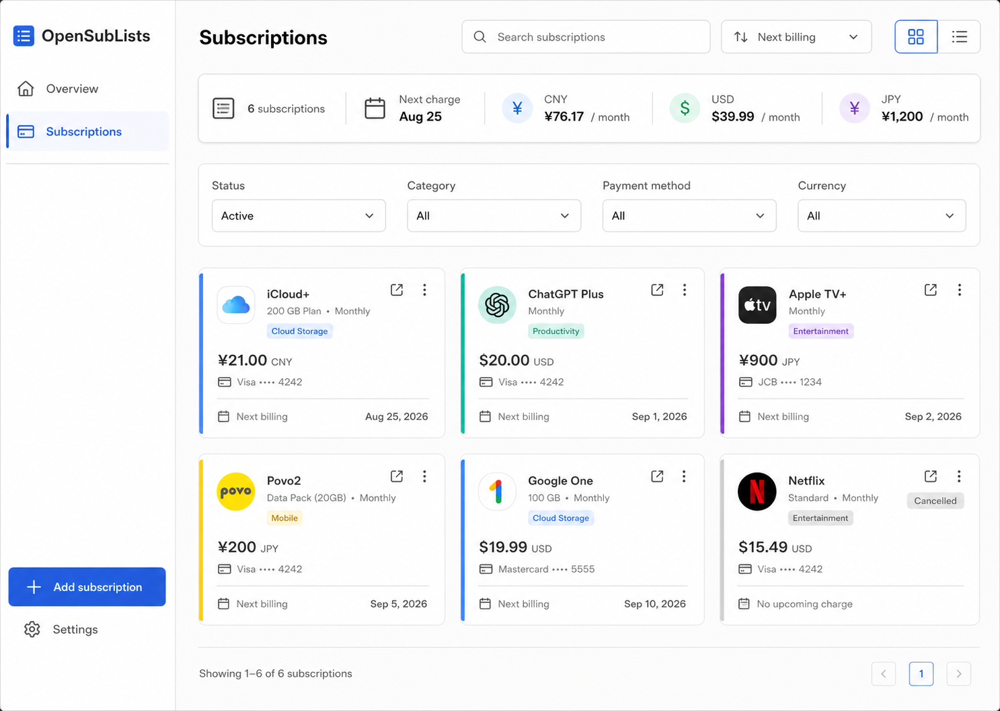

# OpenSubLists MVP UI Flow

> Status: MVP information architecture and interaction plan  
> Last updated: 2026-08-23  
> Targets: Narrow and wide web-browser viewports

## 1. Product Experience Goals

- Show what will be charged next without requiring setup beyond the first subscription.
- Make adding a subscription faster than maintaining a spreadsheet.
- Keep cancellation, archiving, and permanent deletion clearly distinct.
- Present multiple currencies without misleading combined totals.
- Work comfortably on a phone while retaining an efficient wide-browser list.
- Keep advanced recurrence behavior available without overwhelming the default form.

## 2. Authentication Boundary

Cloudflare Access owns the sign-in UI. The application has no custom login, password, reset-password, or registration screens in the MVP.

Application behavior:

- Unauthenticated visitors are redirected by Access.
- An expired session during an API request produces an in-app session-expired state.
- The user can refresh to re-authenticate.
- Sign out links to the Cloudflare Access logout endpoint.

## 3. Route Map

```text
/
├── dashboard
├── subscriptions
│   ├── new
│   └── :subscriptionId
│       └── edit
└── settings
    ├── profile
    ├── categories
    ├── payment-methods
    └── data
```

`/` redirects to `/dashboard` after authentication. The route and feature remain named Dashboard in code and documentation, while the visible English navigation label and page heading are `Overview`. The label uses a localization key rather than a route-derived string.

## 4. Responsive Navigation

### Wide Browser

- Persistent left sidebar.
- Primary items: Overview, Subscriptions, Settings.
- Global Add Subscription button remains visible.
- Content uses a centered maximum width while lists may expand wider.

### Mobile

- Bottom navigation for Dashboard, Subscriptions, and Settings.
- A prominent Add button is available from Dashboard and Subscriptions.
- Create and edit forms use a full-screen route rather than a small modal.

Navigation state is URL-driven so browser Back and Forward behavior remains predictable.

## 5. First-run Experience

On the first login:

1. Resolve the browser's IANA time zone and preferred locale.
2. Suggest a default currency based on explicit user choice, not silent geolocation.
3. Ask the user to confirm time zone and default currency.
4. Show an empty dashboard with one primary action: Add your first subscription.

The user may skip display-name entry. The application does not block first use on category or payment method setup.

## 6. Dashboard

## 6.1 Information Order

1. Next charge.
2. Charges due in the next 30 days.
3. Monthly and annualized estimates by currency.
4. Category breakdown.
5. Recent or newly added subscriptions when useful.

At wide browser widths, the upcoming-charge agenda is the dominant content area. Summary information supports the agenda rather than competing with it as a dense analytics dashboard.

## 6.2 Multiple Currencies

Each currency receives a separate summary row or card:

```text
CNY  ¥128.00 monthly estimate
USD  $19.98 monthly estimate
JPY  ¥1,200 monthly estimate
```

The UI must not show one grand total until exchange-rate conversion is implemented and clearly labeled.

Monthly estimates are the default wide-browser presentation. Annualized estimates remain available through a compact Monthly/Annual control or equivalent disclosure without changing the currency-separation rule.

## 6.3 Upcoming Charges

- Default window: 30 days.
- Optional quick filters: 7 days and 30 days.
- Group entries by billing date.
- Show name, amount, currency, category color, and billing date.
- Selecting an entry opens subscription detail.
- The next-charge summary is calculated independently of the selected upcoming window, so it can show the next active charge even when it falls outside a 7-day view.
- Every occurrence inside the selected window is represented. A daily or weekly subscription may therefore appear more than once.

## 6.4 Empty Dashboard

Display:

- A short explanation of what will appear.
- Add Subscription as the only primary action.
- Import Existing Data as a secondary action when import is implemented.

## 7. Subscription List

## 7.1 Default View

- Exclude archived subscriptions.
- Include active and cancelled records, visually distinguishing cancelled ones.
- Sort by next billing date, then name.
- Cancelled records without a next date appear after active records.

## 7.2 Filters

- Search by name.
- Status: All, Active, Cancelled.
- Category.
- Payment method.
- Currency.
- Archived: Exclude, Only, Include.

Filters are represented in URL search parameters and survive refresh. A Clear Filters action appears only when filters differ from defaults.

## 7.3 Wide-Browser Presentation

Use a responsive card grid by default at comfortable wide-browser widths. Provide an optional compact list view for users who prefer higher density. Both views include:

- Service.
- Amount and interval.
- Next billing date.
- Category.
- Payment method.
- Status.
- Row action menu.

The selected view is stored as a local display preference. Search, sorting, and resource filters remain URL-driven and behave identically in both views.

## 7.4 Mobile Presentation

Use cards with:

- Service and status.
- Amount and interval.
- Next billing date as the main secondary line.
- Optional category color and payment label.

Filters open in a bottom sheet or full-screen panel.

## 8. Create and Edit Subscription

The form is one route with progressive disclosure.

## 8.1 Primary Fields

Displayed immediately:

1. Name.
2. Amount and currency.
3. Billing frequency and count.
4. Known billing date.
5. Category.
6. Payment method.

Examples of frequency controls:

```text
Every [1] [month]
Every [2] [weeks]
```

## 8.2 Advanced Fields

Collapsed by default:

- End-of-month toggle for monthly schedules.
- Website URL.
- Notes.

The end-of-month toggle includes an example explaining the difference between February 28 → March 28 and February 28 → March 31.

## 8.3 Billing Preview

Before saving, show the next three calculated occurrences when enough valid schedule input exists:

```text
Next charges
Aug 31, 2026
Sep 30, 2026
Oct 31, 2026
```

This preview is client-side convenience. The server recalculates the schedule and the saved response is authoritative.

## 8.4 Validation

- Validate fields after interaction and on submit.
- Preserve entered values after a server validation error.
- Place a concise summary near the submit action when multiple errors exist.
- Focus the first invalid field after submission.
- Do not accept or display scientific notation for money.

## 8.5 Submit Behavior

- Disable duplicate submission while a request is pending.
- On create, navigate to the new subscription detail or back to the originating list with a success message.
- On edit, remain on detail and show the updated server-calculated next date.

## 9. Subscription Detail

Display:

- Name and lifecycle state.
- Amount and recurrence.
- Next billing date.
- Next three occurrences.
- Category and payment method.
- Website and notes.
- Created and last-updated timestamps in a secondary section.

Primary actions:

- Edit.
- Cancel or Reactivate.
- Archive or Unarchive.

Permanent Delete is placed in a danger section and never beside the primary Edit action.

## 10. Lifecycle Interactions

### 10.1 Cancel

Confirmation explains:

- The record remains available.
- Future charges stop appearing.
- The subscription can be reactivated.

### 10.2 Archive

Archive is reversible and normally requires no blocking confirmation. A toast provides immediate Undo while the request is reversible in the current UI session.

Archived subscriptions are excluded from normal dashboard totals.

### 10.3 Permanent Delete

Permanent deletion requires a confirmation dialog that names the subscription and explains that application recovery is not available. The UI should encourage Archive when the user may only want to hide the record.

### 10.4 Reactivate

Reactivation previews the newly calculated next billing date before confirmation when the old schedule anchor is far in the past.

## 11. Settings

## 11.1 Profile

- Verified email, read-only.
- Display name.
- Time zone.
- Default currency.
- Sign out.

Changing time zone warns that the definition of local today may change near midnight, then reconciles active subscriptions.

## 11.2 Categories

- Ordered list with color, name, edit, and delete.
- Add and edit use a compact form.
- Deleting a category explains that subscriptions remain and become uncategorized.

## 11.3 Payment Methods

- Ordered list with kind, name, and safe label.
- The form explicitly asks only for a display label, not payment credentials.
- Deleting a method explains that subscriptions remain and lose the association.

## 11.4 Data

- Export JSON.
- Import JSON.
- Archive privacy warning.
- Import preview and conflict resolution.

## 12. Import Flow

1. Select a local JSON file.
2. Validate size before upload.
3. Request server preview.
4. Display resource counts, conflicts, and warnings.
5. Select conflict strategy: Skip, Overwrite, or Duplicate.
6. Optionally import profile settings.
7. Require an explicit confirmation.
8. Upload and validate the same archive again with the expected digest.
9. Display created, updated, skipped, and warning counts.

The UI never hides unsupported native SubList fields. Warnings remain downloadable or copyable after import.

## 13. Loading, Error, and Session States

### Loading

- Use stable skeletons for dashboard and list layouts.
- Avoid replacing the entire application shell during route loads.
- Buttons show progress without changing width.

### Empty

- Empty states explain the next useful action.
- Filtered-empty states offer Clear Filters instead of Add Subscription as the only option.

### Network Error

- Keep existing data visible when a refresh fails.
- Offer Retry.
- Never claim a write succeeded without a successful response.

### Session Expired

- Detect `401` from AJAX requests.
- Show a concise session-expired message.
- Refresh or navigate through Access authentication while preserving the intended return route.

### Not Found

Use the same not-found presentation for absent resources and resources owned by another user.

## 14. Accessibility

- All functions are keyboard operable.
- Visible focus styles are mandatory.
- Form controls have programmatic labels and error associations.
- Status is not conveyed by color alone.
- Category colors meet contrast requirements where used with text; otherwise pair them with labels.
- Touch targets are at least 44 by 44 CSS pixels where practical.
- Dialogs manage focus and return it to the trigger.
- Respect reduced-motion preferences.
- Tables provide an equivalent mobile reading order.

## 15. Localization

- Initial locales: English and Simplified Chinese.
- All UI strings use stable localization keys.
- Dates use the active locale but retain the user's configured time zone.
- Currency formatting uses `Intl.NumberFormat` with explicit currency.
- Internal status and error codes remain English identifiers.
- Imported user content is never translated.

## 16. Visual Direction

- Calm utility-product appearance rather than financial-trading styling.
- Light and dark color schemes through CSS custom properties.
- Category color is an accent, not the only identifier.
- Monetary totals use tabular numerals.
- Avoid decorative charts when a compact list communicates the same information more clearly.
- No custom background images or uploaded icons in the MVP.

### 16.1 Selected Dashboard Prototype


This image is the selected visual reference for the authenticated wide-browser `/dashboard` route. It establishes:

- The same responsive web application shell, persistent navigation, typography, spacing, surface treatment, and Add Subscription action used by the selected Subscriptions prototype.
- `Overview` as the visible localized English label for the Dashboard route.
- A next-charge summary and a separate 30-day amount for each currency, with no combined cross-currency total.
- A 30-day renewal agenda as the dominant content area, with a secondary 7-day view.
- Separate monthly estimates by currency and a restrained category breakdown based on active subscription counts.
- A compact first viewport that favors lists and direct values over decorative charts.

The image is directional rather than normative. Its product names, icons, amounts, dates, categories, and currency examples are mock content. The implementation must also expose annualized estimates through compact progressive disclosure, generate every recurrence occurrence inside the selected window, preserve the route and API rules in this document, and use system or monogram icons unless a separate MVP asset decision is approved. The image does not authorize uploaded service artwork.

### 16.2 Selected Subscriptions Prototype



This image is the selected visual reference for the authenticated wide-browser `/subscriptions` route. It establishes:

- A responsive web application shell with persistent navigation and one prominent Add Subscription action.
- Search, next-billing sorting, and grid/list display controls in the page header.
- Separate monthly estimates for each currency with no combined cross-currency total.
- Status, category, payment-method, and currency filters above the result set.
- A responsive subscription-card grid that exposes amount, currency, recurrence, category, payment method, next billing date, and lifecycle state without opening the record.
- A visibly distinct cancelled state that remains in the normal unarchived collection when the active filters include it.

The image is directional rather than normative. Product names, logos, amounts, dates, payment labels, filter selections, and pagination values are mock content. The route behavior, default filters, tenant isolation, localization, accessibility requirements, money rules, lifecycle semantics, and responsive behavior in this document remain authoritative. The implementation uses system or monogram icons unless a separate MVP asset decision is approved; the image does not authorize uploaded service artwork.

## 17. Analytics and Privacy

The MVP does not include third-party product analytics. Operational logs cover reliability without recording subscription names or notes.

If analytics are added later, they require an explicit privacy review and must default to event metadata that cannot reveal a user's subscriptions.

## 18. Critical Acceptance Flows

### First Subscription

```text
First login → Confirm time zone and currency → Add subscription → See next charge on dashboard
```

### Routine Update

```text
Open subscription → Edit amount or schedule → Preview → Save → See recalculated next charge
```

### Cancellation

```text
Open subscription → Cancel → Confirm → Record remains visible without future charges
```

### Archiving

```text
Archive from list → Record disappears → Show archived filter → Unarchive
```

### Backup

```text
Settings → Data → Export JSON → Browser downloads private non-cacheable archive
```

### Migration

```text
Settings → Data → Select archive → Preview warnings → Choose strategy → Confirm → Review result
```

## 19. Deferred UX

- Public sign-up and invitation management.
- Shared subscriptions and family workspaces.
- Browser push notifications.
- Email reminder configuration.
- App Store or screenshot import.
- Price history and pause timeline.
- Exchange-rate controls.
- PWA installation prompts.
- Custom icons and images.
