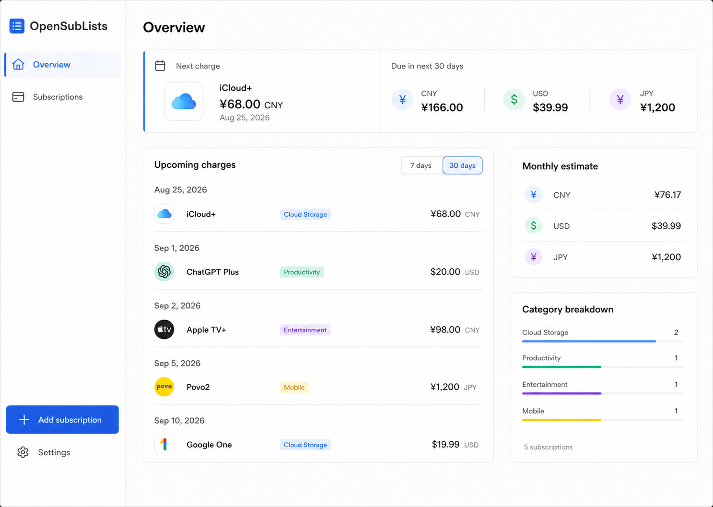

## See upcoming costs clearly

OpenSubLists is a responsive website for recording subscriptions. It is an estimated
ledger, not a bank feed: projected charges come from the recurrence rules you enter.

## Choose a starting point

- **Run locally** with local D1 and a fixed development identity. You do not need a
  Cloudflare account for this path.
- **Self-host on Cloudflare** when you are ready to use your own hostname, D1 database,
  and invite-only Access policy.

[Follow the self-hosting guide](/guide/self-hosting) or
[view the source repository](https://github.com/hansarnold/SubList).
